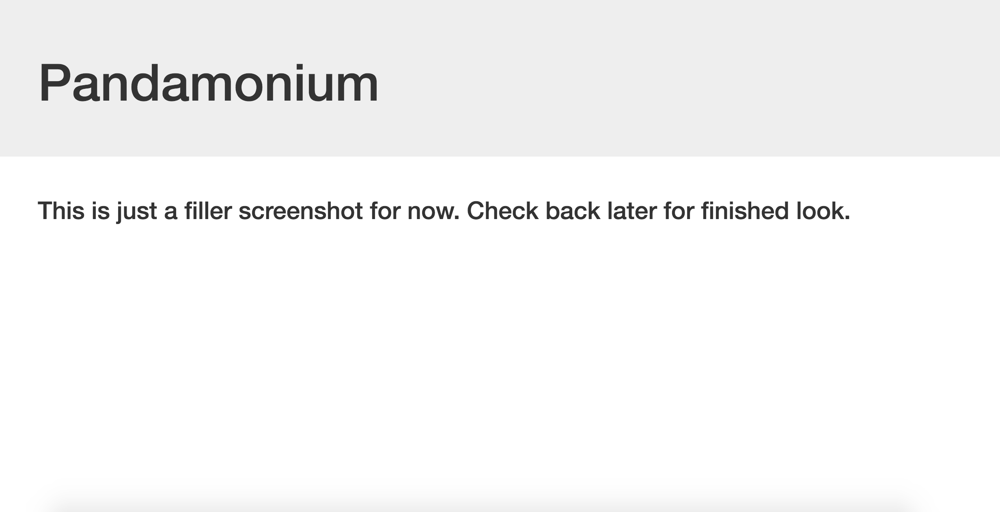

# Zoo Tracker
### Steven Galvin, June 9th, 2017

This web app was made primarily with Typescript and Angular 2. It's purpose is to show off my week three knowledge from Epicodus and my efficiency with TS and Ang2. This zoo tracker is a simple app designed to give the user the ability to create animals in a zoo with certain properties(species, name, diet, age, etc.). It gives the user the ability to sort the animals by certain parameters, add new animals, and edit existing ones.

## Landing Page:

## Planning

### 1. Configuration/dependencies
  The app will primarily use the Angular 2 framework and Typescript. It was made with the basics learned from week 3 at Epicodus. Stretch goals include:
    * Using Sass to style the page better.
    * Building out the animal model to include more information like temperament, an array of likes and dislikes to allow for more than one, image of animal, or scientific name.

### 2. Specs
  * Spec 1: User can create animals and display them on the page.
  * Spec 2: User can edit created animals.
  * Spec 3: User can pick how the want to view animals(only young, only old, by species, etc.).

### 3. Integration
  * Root component/Index page.
  * New animal component.
  * Edit animal component.

### 4. UX/UI
  * Include Bootstrap, sass is a stretch goal.

### 5. Polish
  * Refactor code.
  * Delete unused code.
  * Make README awesome.

## Prerequisites

You will need the following things properly installed on your computer.

* [Git](https://git-scm.com/)
* [Node.js](https://nodejs.org/) (with NPM)
* [Typescript](https://www.typescriptlang.org/)

## Installation

As of writing this README, these instructions work on MacOS.

* Run `$ git clone <this-repository-url>`
* Then `$ cd zoo-tracker`
* Once in the zoo-tracker folder, run `$ npm install` and `$ bower install`

## Running / Development

Now that everything you need should be installed, we can run it with gulp.

* Run `$ gulp serve`
* Visit your app at [http://localhost:3000](http://localhost:3000).

## Built With

* Angular
* Typescript
* HTML
* CSS/SASS
* Bootstrap https://getbootstrap.com/
* ES6
* Jquery https://jquery.com/
* Node
* Bower

## Authors

Steven Galvin

## License

MIT License

Copyright (c) Steven Galvin, 2017

Permission is hereby granted, free of charge, to any person obtaining a copy
of this software and associated documentation files (the "Software"), to deal
in the Software without restriction, including without limitation the rights
to use, copy, modify, merge, publish, distribute, sublicense, and/or sell
copies of the Software, and to permit persons to whom the Software is furnished to do so, subject to the following conditions:

The above copyright notice and this permission notice shall be included in all
copies or substantial portions of the Software.

THE SOFTWARE IS PROVIDED "AS IS", WITHOUT WARRANTY OF ANY KIND, EXPRESS OR
IMPLIED, INCLUDING BUT NOT LIMITED TO THE WARRANTIES OF MERCHANTABILITY,
FITNESS FOR A PARTICULAR PURPOSE AND NONINFRINGEMENT. IN NO EVENT SHALL THE
AUTHORS OR COPYRIGHT HOLDERS BE LIABLE FOR ANY CLAIM, DAMAGES OR OTHER
LIABILITY, WHETHER IN AN ACTION OF CONTRACT, TORT OR OTHERWISE, ARISING FROM,
OUT OF OR IN CONNECTION WITH THE SOFTWARE OR THE USE OR OTHER DEALINGS IN THE
SOFTWARE.
